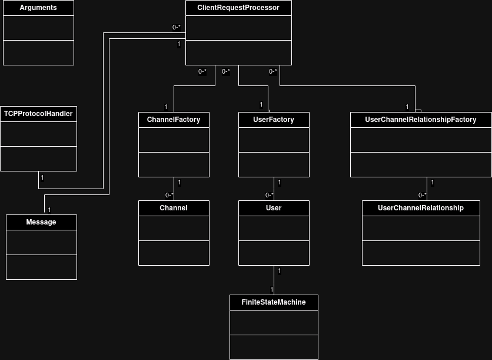

# Chat server using IPK24-CHAT protocol

## Overview
This is a chat server application that facilitates communication between clients using either the User Datagram Protocol (UDP) or Transmission Control Protocol (TCP). It listens for incoming connections and messages from clients, relays messages between connected clients within the same channel, and manages the overall chat experience.

## Usage
```./ipk24chat-server {parameters}```

Parameters:<br>
- **l**: server listening IP address for welcome sockets (predefined value is 0.0.0.0).
- **p**: server listening port for welcome sockets (predefined value is 4567).
- **d**: UDP confirmation timeout (predefined value is 250).
- **r**: maximum number of UDP retransmissions (predefined value is 3).
- **h**: prints program help output and exits.

## Architecture Overview
Work with users, channels and relationships between them is created using the Factory pattern designed for object-oriented programming. The ChannelFactory, UserFactory and UserChannelRelationshipFactory classes contain a list of all current elements and functions for working with users, channels or user-channel relationships.<br>
The main engine that controls what happens when is the ClientRequestProcessor class. Thanks to the Message class (which parses the incoming packet) it finds out what operation to perform. These operations are also performed by ChannelFactory (operates with channels), UserFactory (contains current users, their unique ID) and UserChannelRelationshipFactory (contains relationships between users and channels, i.e. which user is in which channel).<br>

### TCP Communication
TCP communication is designed using the poll() method. It stores connected clients in the variable `std::map<int, int> connectedClients`, thanks to which it can determine which client sent a new packet. In this method, there is also a variable `std::map<int, std::string> incompleteMessage` which is used to assemble incoming packets (if the message is divided into several packets, it will be combined in this variable. If there are more messages in one packet , so thanks to this variable, the first right is taken first, then the second, and so on).<br>
After identifying the sender and obtaining the first complete message, the incoming message is parsed in the Message class. In the case of an incorrect format, `REPLY NOK FROM Server IS {error message}` is returned. If the parsing goes well, it goes to the ClientRequestProcessor class, where the given operation is performed according to the received message. After performing the operation, the server responds to the specific client according to the assignment. In the case of broadcast messages (e.g. a message from a user, a JOIN message,...) the TCPProtocolHandler class gets a list of clients that are in the same channel as the current user from the UserChannelRelationshipFactory class. Next, it performs a cycle in which it sends a response from the server in the form of a TCP packet to all acquired clients.

### Skeleton Of Class Diagram
This skeleton class diagram is intended for understanding object-oriented design, not for detailed technical documentation of class variables and methods.


## Exceptions
This section describes the exception handling mechanism used in this project. Exceptions are objects thrown by functions to indicate error conditions.

Error codes and what they mean:
- **0**: there is no error in code (zero is not error code but it is there just for documentation purpose).
- **10**: error code for invalid argument provided to a function. (implemented in Exceptions/ArgumentException.cpp)
- **20**: error code for invalid channel name. (implemented in Exceptions/ChannelException.cpp)
- **30**: error code for user problems. (implemented in Exceptions/UserException.cpp)
- **40**: error code for network problems. (implemented in Exceptions/NetworkException.cpp)
- **99**: generic error code for unexpected errors.

## Tests
Unit testing is done using Google Test with separate test files for each class, promoting modularity and focused testing.  This approach simplifies maintenance and improves test organization.<br>
In tests there is also class ClientClass that simulates client.<br>
Test can be run using the `make test` command.

## License
This project is licensed under the [GNU General Public License v3.0 (GPL-3.0)](https://www.gnu.org/licenses/gpl-3.0.html). See the [LICENSE](LICENSE) file for details.
